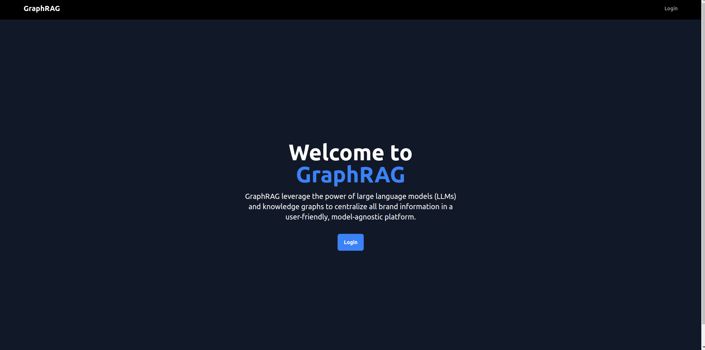
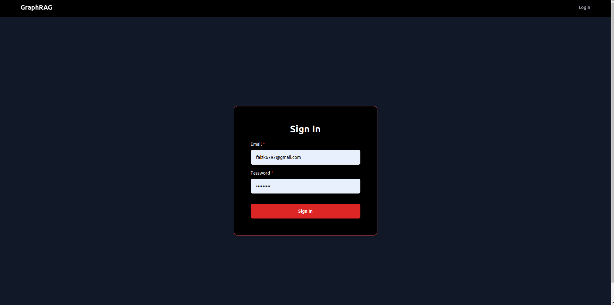
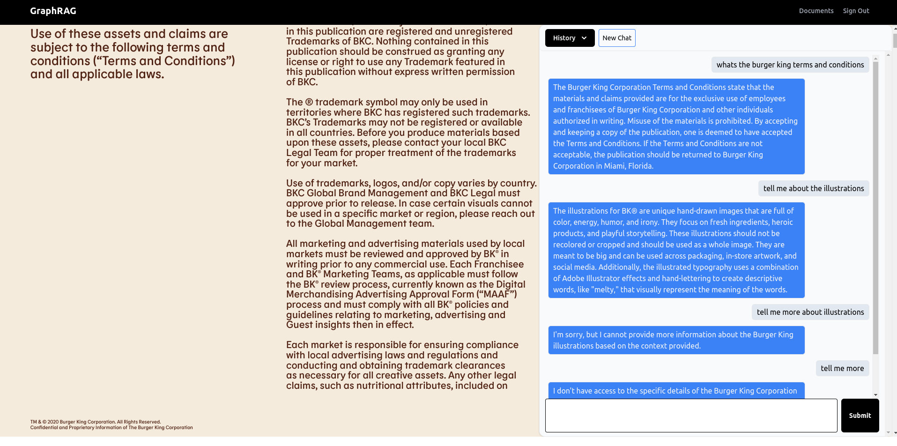
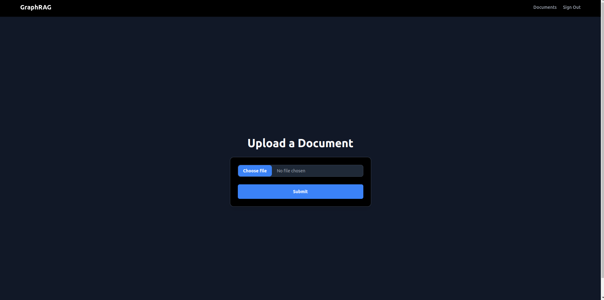

# GraphRAG
GraphRag is a standalone application that uses Flask as backend and ReactJS as frontend, langchain , pinecone DB to store vector embeddings and SqLite to store chat history.

## Table of Contents
* [General Info](#general-information)
* [Technologies Used](#technologies-used)
* [Features](#features)
* [Screenshots](#screenshots)
* [Setup](#setup)
* [Usage](#usage)


## General Information
GraphRAG uses the power of Generative AI and NLP to centralize all brand information in a user-friendly, model-agnostic platform. This innovative approach aims to:
Reduce brand guideline misuse
- Accelerate access to brand knowledge for creatives
- Enable precise retrieval of brand information
- Alleviate the stress on creatives by simplifying prompt engineering

## Technologies Used
- React JS
- Python 
- Flask
- SqlLite
- Pinecone DB
- Langchain
- Open AI API

## Features
- API endpoints 
- Login and Signup
- Home Page
- Dashboard to view and upload new PDF
- Chat screen
- History dropdown 
- RAG Pipeline on Vector Database and Orchestration tool like LangChain
- Standalone application that one can use any frontend to integrate APIS'

## ScreenShots






## Setup
Since this is a standalone application that uses APIS', one can ignore backend folder and jump to frontend folder
```
cd frontend
npm install // to install the dependencies
npm run dev // to run the local application
```
Note - If you want to start server locally then follow the steps:
```
cd backend

## Using Venv 

# Create the venv virtual environment
python -m venv .venv

# On MacOS, WSL, Linux
source .venv/bin/activate

# On Windows
.\.venv\Scripts\activate

# Install dependencies
pip install -r requirements.txt


# Running the app 

This server is built using Flask with different API endpoints. So you just need to start the server and can use Frontend as a standalone application.

Commands to start are listed below. If you need to stop them, select the terminal window the process is running in and press Control-C

### To run the Python server

Open a new terminal window and create a new virtual environment:


# On MacOS, WSL, Linux
source .venv/bin/activate

# On Windows
.\.venv\Scripts\activate

Then:

inv dev


```

There are some environment variables that needed for correct functioning of local server. 
in backend folder,
```cd backend```,
create .env inside backend folder and paste the followings

```
SECRET_KEY=123
SQLALCHEMY_DATABASE_URI=
UPLOAD_URL=upload-url
OPENAI_API_KEY=openAI API key
PINECONE_API_KEY=pinecone API key
PINECONE_ENV_NAME=us-east-1
PINECONE_INDEX_NAME=pdf-docs
```
- Open a new terminal cd `/path/to/backend` and activate the `.venv`, use the below command to create new user
```
flask --app app.web add-user user@example.com supersecret
```

in frontend folder, 
```cd frontend```
Then in .env inside frontend folder, paste 
```
VITE_API_BASE_URL=http://localhost:5173
```

## Usage
- Signup using email and password
- Once logged in, it will open a dashboard and upload button.
- User can upload new document by clicking on the upload button at top right
- User can click on view and will sent to the chat interface
- In Chat interface, user can chat and ask questions regarding the documents and brand guidelines.
-There is a history dropdown where user can switch to the past conversations as well.
-  Clicking on new chat button will open up the new conversation.


```
Note - In chat interface on left side is also a pdf viewer where user can view the uploaded docs while having a conversation. I have commented that code because it was giving performance issue if the uploaded file is large.
You can go to [FILE](frontend/src/page/document-view.tsx) and remove the comment.```


